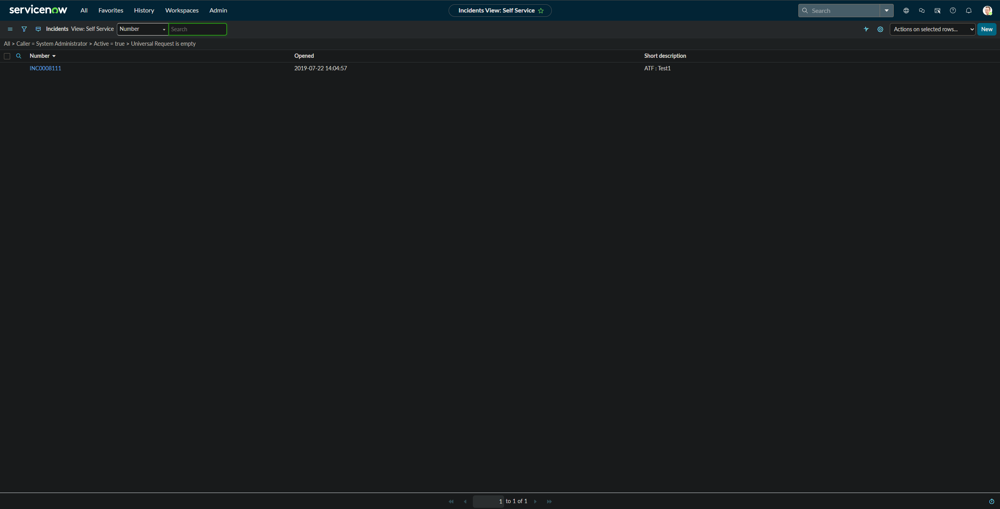
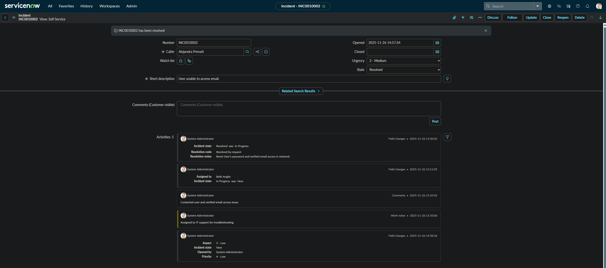

# ServiceNow Incident Management

This repository showcases my hands-on ability to manage **ServiceNow incidents from start to finish**, including:
- Creating new incidents
- Updating states and fields
- Assigning tickets
- Adding work notes & customer comments
- Troubleshooting and resolving issues
- Documenting activity logs professionally

---

## 🟦 Step 1 — Creating a New Incident
I created a new incident using the **Self-Service Incident View**, filling out essential info such as:
- Caller
- Short description
- Impact, Priority, and Urgency
- Initial state (**New**)

**Screenshots:**

---

## Step 2 — Updating Ticket Details
As work progressed, I updated the incident with:
- State changes (**New → In Progress**)
- Customer-visible comments
- Accurate timestamps captured in the activity log

**Screenshot:**

---

## Step 3 — Assigning the Ticket
I assigned the ticket to the appropriate support member by:
- Selecting the correct "Assigned to" user
- Routing it to the right support queue

📸 **Screenshot:**

---

## Step 4 — Added Work Notes & Customer Comments
Throughout troubleshooting, I documented:
- Internal **work notes** for IT staff
- Customer-visible updates
- Verification steps and communication details

📸 **Screenshot:**

---

## Step 5 — Troubleshooting Actions
I performed and documented actions such as:
- Verifying user reports
- Checking account status
- Routing to IT support
- Confirming email access restoration

---

## Step 6 — Resolving the Ticket
Once the issue was fixed, I:
- Updated the state to **Resolved**
- Added detailed resolution notes
- Selected a proper resolution code (e.g., "Resolved by request")
- Ensured the user regained full access

📸 **Screenshot:**

---

## Step 7 — Ticket Closure Confirmation
With the incident resolved and fully documented, the ticket is ready for closure by workflow automation or review.

---
